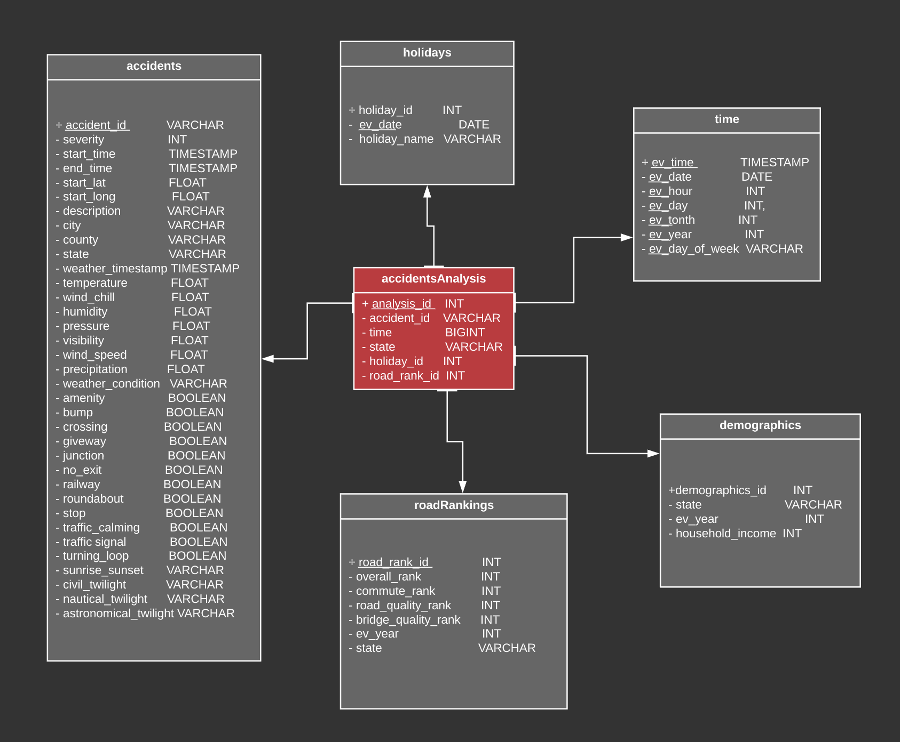

# US Car Accidents :blue_car:

ETL that extracts data from various sources to load car accident into a 
PostgreSQL database using a **star schema** design.  
Packages used include pandas and psycopg2.



### Project Structure
```
<pre>
US-Car-Accident-ETL-Analysis
| README.md
| uml.png
| tableau_dashboard.png
| 
└─── data # state ranking and usholidays data only  
          # car accident data foundhere '<a href="https://www.kaggle.com/sobhanmoosavi/us-accidents" title="us-car-accidents">here</a>'
|  | └─── state_road_rankings.csv
|  | └─── usholidays.csv
|
└─── db_modules
|  | └─── db_connections.py
|  | └─── sql_queries.py # contains drop, insert, create statements
|
| create_database.py # creates the accidentAnalysis database tables
| etl_helper.ipynb # preliminary code to set up ETL
| etl_processor.py # loads accidents, holidays, time, and demographics data

</pre>
```

